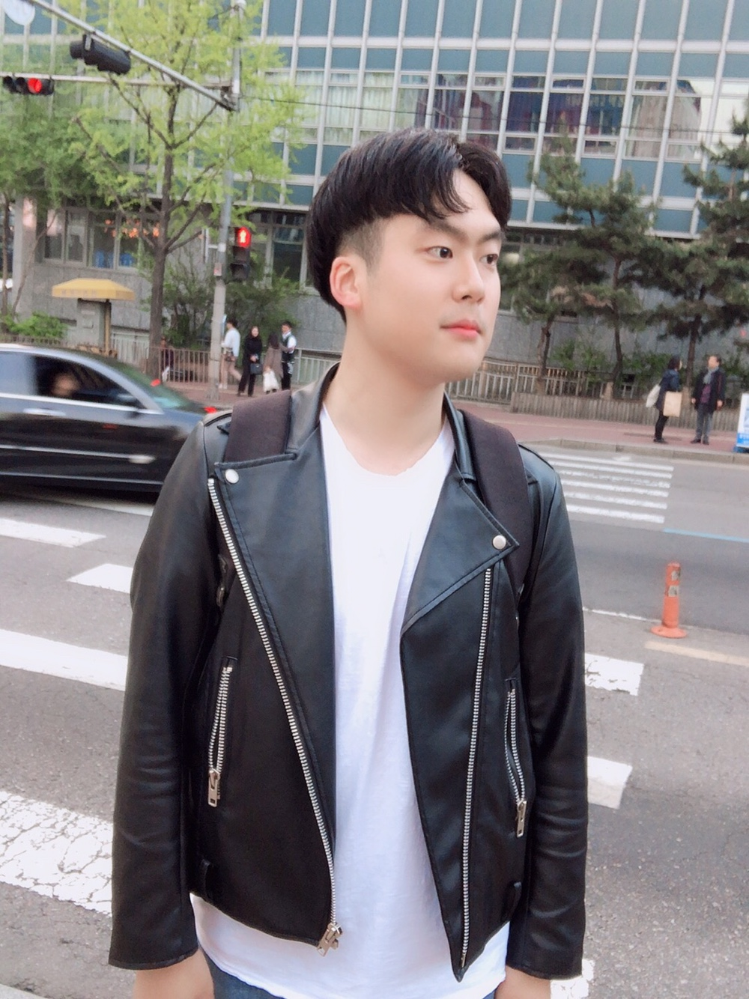

# 이찬규 Portfolio
**이찬규 / Chankyu Lee / 李燦揆 / 李粲揆**

순수 미술을 전공한 사람입니다. 복수전공으로 시각디자인을 전공하여 일러스트레이트, 포토샵, 인디자인, 에프터이펙트 현재는 UX/UI를 공부하고 있는 사람입니다.

- 대한민국 경기도 고양시 거주
- 군 복무 중 (대한민국 육군 2012.09.10 ~ 2014.06.09)
- Phone : +82 10-9259-6612
- Email : cksrb1002@gmail.com
- GitHub : github.com/LeeChanQ

## 학력 / Education

### 협성대학교
- 대한민국 수원시 팔달구 소재
- 조형회화학과 전공
- 시각디자인학과 복수전공
- 학적 변동 이력
  - 2011.02 ~ 2019.02.15 / 재학
  - 2012.09.10 ~ 2014.06.09 군 입대 휴학
  - 2015.02.25 ~ 2016.06.27 중국 북경 유학 휴학

### 신일정보산업고등학교
- 대한민국 경기도 고양시 소재
- 컴퓨터그래픽학과 전공
- 2008.03 ~ 2011.02 / 졸업

## 보유 기술 / Skills

이름 | 하 | 중하 | 중 | 중상 | 상
--- | --- | --- | --- | --- | ---
일러스트레이트 | | | | O | |
포토샵 | |  | O | | |
인디자인 | | | O | | |
에프터이펙트 | | O | | | |
Sketch | |  | O | | |

## 이력 / career
- 중국 HSK 5급 자격증 취득

## 프로젝트 / Projects

### 화성시 산업협력 Projects
- 일시 : 2018.03.02 ~ 2018.06.18
- 화성시 산업협력에서 연잎차를 홍보를 위한 디자인 프로젝트 참여
- 프로젝트 일원, 발표 등에서 활동

### 메가박스 UX/UI 리뉴얼 디자인
일시 : 2019. 03.11 ~ 04.02

### 사랑먹고 잉꼬 앱 개발
일시 : 2019. 04. 15 ~ 05. 21

### 노인 보호 IOT
일시 : 2019. 04. 09 ~ 04. 28

--------------

## 수상 경력 / Awards

### 강원도 원주시청과 함께하는 벽화마당  
* 2014.05. 23

### 2018년 협성대학교 총학생회 총학생회장 역임  
* 2017.12.21 ~ 2018.12.24

### 신한은행 학생활동 우수자상 수여
* 2019.02.15